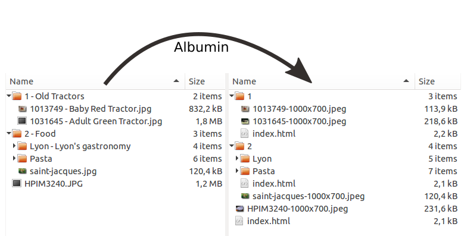

# Albumin
Simple Hierarchical Album Generator

From just directories and raw pictures, Albumin builds a complete deep browsable site, reducing pictures' size and computing pretty background colors in the making.

# Example

Directories and pictures in /example are built into [this site](http://dystroy.org/albumin-example).

# Usage

	node index.js sourceRootDirectory destinationRootDirectory

The hierarchy of directories and pictures is reproduced in the destination.

When a directory or picture is named in two parts separated by spaces and a dash (i.e. `somepart - A title`) then the first part is used for ordering and to name the destination file while the second part is used as a description (a title for albums, a caption for pictures).

When a directory contains other directories, it's handled as a summary page: a list of links with the background based on the first image (there's no need to put more than one image in that directory).

# Installation

You first need to have imagemagick installed.

Then install other dependencies by running this in Albumin's directory:

	npm install

# Customization

There's none yet, because it was made for my own simple need. If you think you could use Albumin, contact me in the chat.

# Licence

MIT
